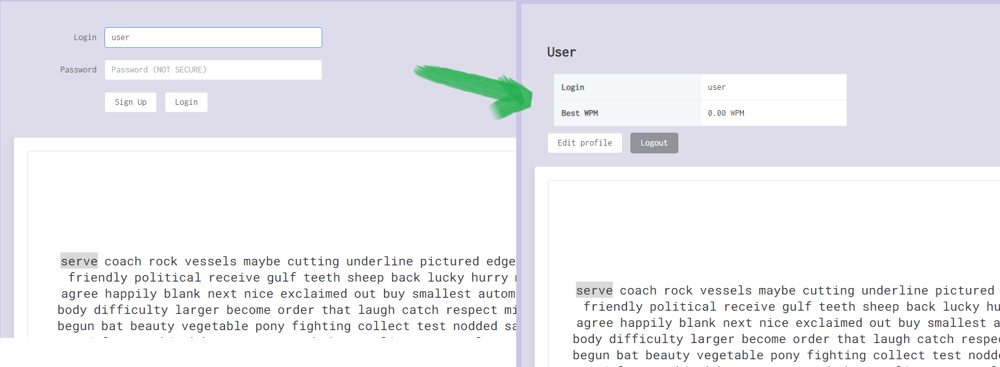
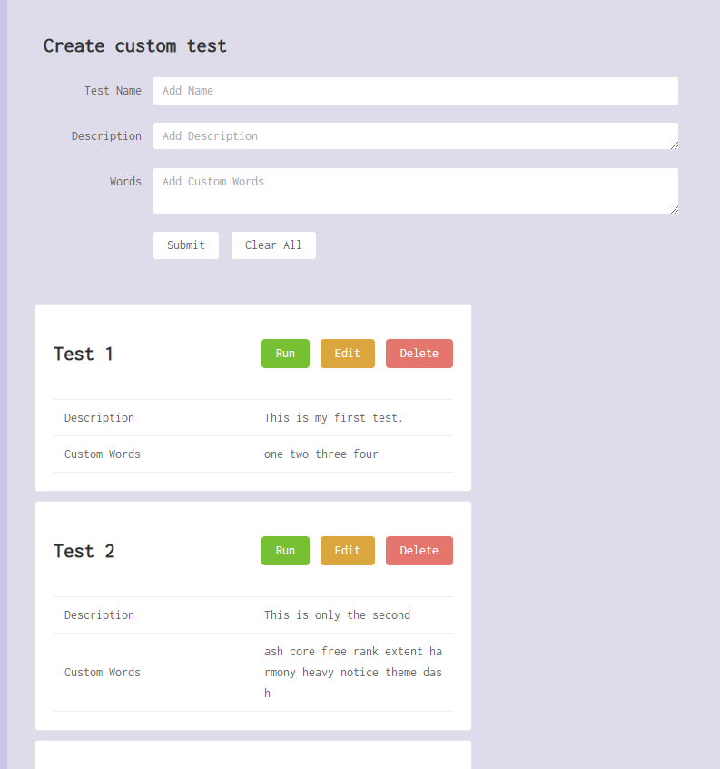
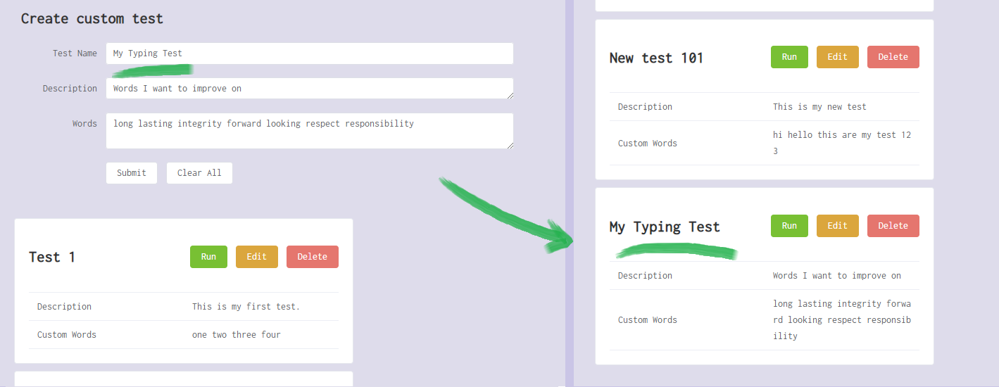
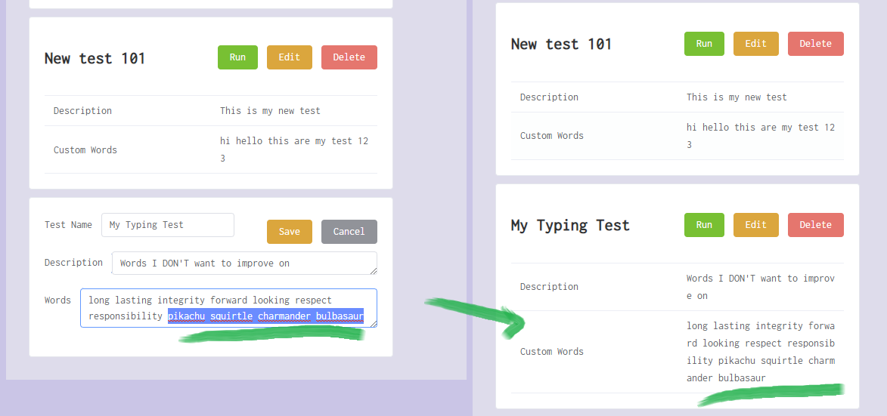
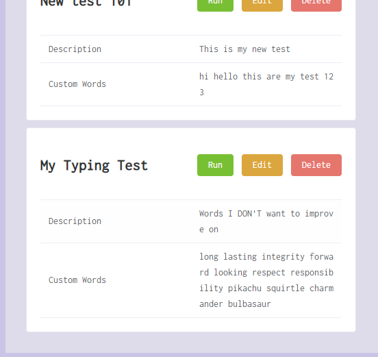
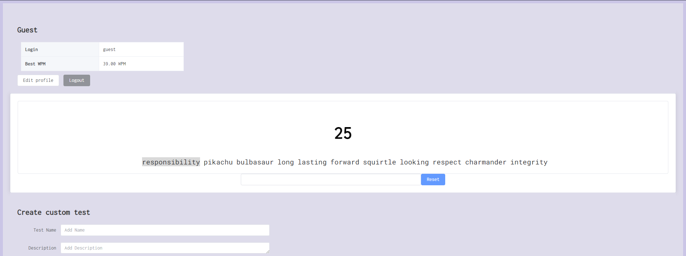
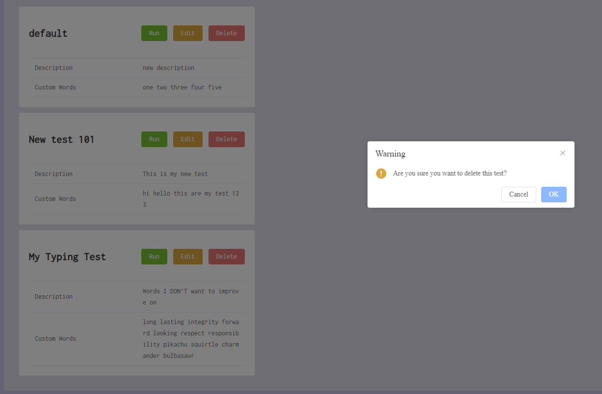

# Typing Test

Link to site: http://student-4.sutdacademytools.net (Hopefully its up)

### Link to backend repository: https://github.com/austin-jrh/sutd-devtools2022-backend

---

### Table of Contents 
- [Features](#features)
- [Technical Stack](#technical-stack)
  - [Front-end](#front-end)
  - [Back-end](#back-end)
  - [Deployment](#deployment)
- [Demo](#demo)
- [Setup](#setup)
- [Security Vulnerability](#security-vulnerability)

## Features

Typing Test is a simple typing test app where you can measure your typing speed.

Features are:
- User Profile
  - Register, Login, Edit Display Name, Persistent User using `localStorage`.
- Typing Test
  - Generate Random words, Custom user defined words, (scuffed) WPM calculation, saving of high score to logged in user.
  
Words per minute is calculated with the following formula:


Taken from: https://www.typingtyping.com/wpm-calculator/

_Note_: The formula is loosely followed because shortcuts are done due to technical limitations. Therefore, the WPM calculation is not very accurate.

## Technical Stack
### Front-end
Using:
- Vue.js (MVVM framework)
- Element+ (UI framework)
- random-words (NPM library)
- Google Fonts (Roboto Mono and Inconsolata)

### Back-end
[Link to repository](https://github.com/austin-jrh/sutd-devtools2022-backend)

Using:
- Node.js (runtime environment)
- Express (web application framework)
- Sqlite (database)

### Deployment
Using:
- Docker (Container)
- NGINX (Reverse proxy)
- Amazon EC2 (Cloud)

## Demo
- Login to existing user




- Edit display name of logged in user


- Custom tests




- Create Custom Test




- Edit existing Custom test




- Run Custom test





- Delete existing Custom test




## Setup
1. Clone the repository. 
```
git clone https://github.com/austin-jrh/sutd-devtools2022.git
```

2. Install Docker.
```
# Install Docker packages
sudo apt-get update
sudo apt-get install \
    ca-certificates \
    curl \
    gnupg \
    lsb-release
    
# Add docker official gpg key
sudo mkdir -p /etc/apt/keyrings
curl -fsSL https://download.docker.com/linux/ubuntu/gpg | sudo gpg --dearmor -o /etc/apt/keyrings/docker.gpg

# Setup docker repo
echo \
  "deb [arch=$(dpkg --print-architecture) signed-by=/etc/apt/keyrings/docker.gpg] https://download.docker.com/linux/ubuntu \
  $(lsb_release -cs) stable" | sudo tee /etc/apt/sources.list.d/docker.list > /dev/null

# Install docker engine
sudo apt-get update
sudo apt-get install docker-ce docker-ce-cli containerd.io docker-compose-plugin
 
# Start the service
sudo service docker start

# Run docker without sudo,
sudo groupadd docker
sudo usermod -aG docker $USER
newgrp docker 
docker ps 
```

3. Navigate to path where the `Dockerfile` exist.
```
cd devtools2022-frontend/
ls # you should be in the Dockerfile directory
```

4. Run `run.sh` to build and run Dockerfile.
```
./run.sh
```

5. Verify if the Docker container is running.
```
docker ps
```

## Security Vulnerability

These vulnerabilities are elaborated in [back-end README](https://github.com/austin-jrh/sutd-devtools2022-backend/blob/main/README.md#security-vulnerability).

- SQL Injection attack with crafted form inputs (login) - [link](https://github.com/austin-jrh/sutd-devtools2022-backend/blob/main/README.md#sql-injection-attack-with-crafted-form-inputs-login)
- Modifying the database without authorization (change highscore) - [link](https://github.com/austin-jrh/sutd-devtools2022-backend/blob/main/README.md#modifying-the-database-without-authorization-change-highscore)
- Access to profiles - [link](https://github.com/austin-jrh/sutd-devtools2022-backend/blob/main/README.md#access-to-profiles)
